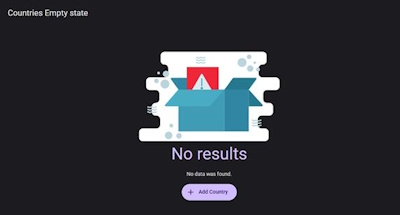
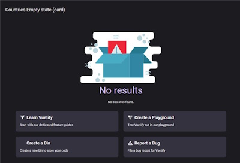
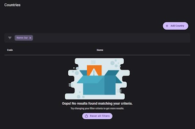

# Table empty state

MkTable empty state will use the global emptyState option from the MediakiwiVueOptions.
There are 2 variants: default and filter. The filter variant will only be shown when the user uses the filters and the table yields no results.

## Customization

### MkTable

You can customize using the props

```tsx
<template>
  <mk-table
    empty-state-headline="Whoops"
    empty-state-title="No items found"
    empty-state-text="Please add a new item"
    empty-state-image="@/assets/empty-state.svg"
  ></mk-table>
</template>
```

You can add custom actions using the slot

```tsx
<template>
  <mk-table>
    <template #emptyStateActions>
      <v-container>
        <v-row>
          <v-col cols="12" md="6">
            <v-card
              href="https://vuetifyjs.com/introduction/why-vuetify/#feature-guides"
              prepend-icon="$vuetify"
              target="_blank"
              text="Start with our dedicated feature guides"
              title="Learn Vuetify"
            ></v-card>
          </v-col>
      </v-container>
    </template>
  </mk-table>
</template>
```

### Global

All properties accept `false` in order to hide it. A default is used when no options are provided.

```ts
const mediakiwiOptions: MediakiwiVueOptions = {
  [...]
  emptyState: {
    filter: {
      image: emptyStateFilterSvg,
      headline: false,
      title: "Oops! No results found matching your criteria.",
      text: "Try changing your filter criteria to get more results.",
    },
    default: {
      image: emptyStateSvg,
      headline: false,
      title: "Oops! No results found matching your criteria.",
      text: "Try changing your filter criteria to get more results.",
    }
  },
};
```

## Screenshots

Default empty state:



Default with custom actions:



Filter yielded no result:


